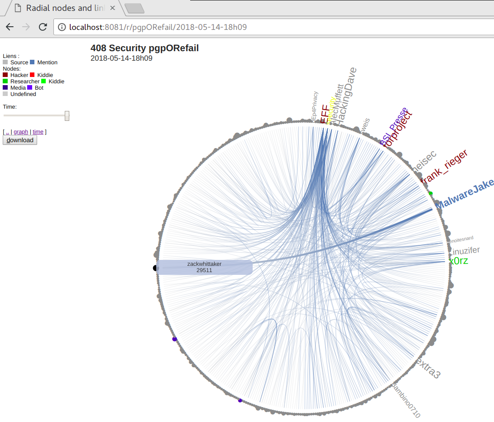
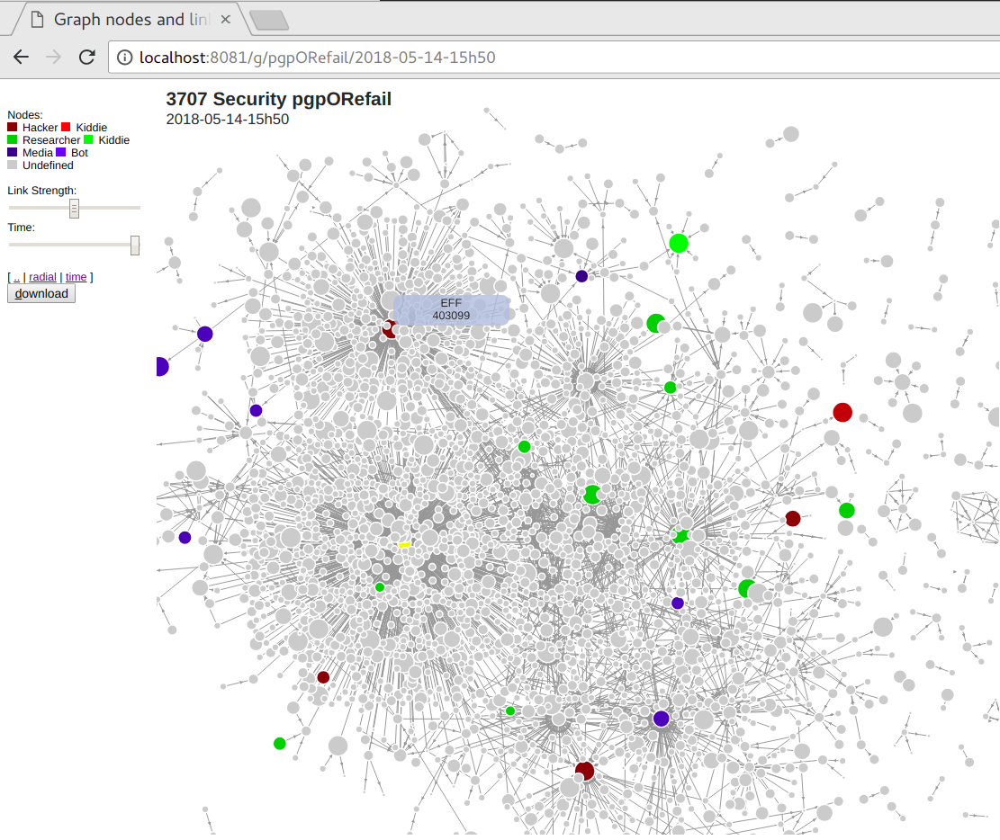

# liquipht
LIght anf QUIck graPH and Timeline viewer 

# Description

``liquipht`` is a golang local web server which allow to watch links data in your browser with d3js views.


|     |     |
| --- | --- |
|  |  |
|  | ``$ ./twminer -conf ./twitterAPI.ini -q "#Efail OR #PGP"``  |
|  |  |


# Quick start

Download your architecture `liquipht` version and `view-vx.y.z.zip` from github release. 
Extract `view-vx.y.z.zip` in same directory. 


## Viewer

Add a ``confsample.ini`` in current directory or use the command line to fix the path.
The INI file allows to define data directory, title and colors legend.


```bash

 ./liquipht &
   |_confsample.ini
   |_views/*.html
   |  |_js/*.js

 data/
  |_ links-[time]-[group].json
  ...
  |_ links-[time]-[group].json
  |_ nodes.json

```

Browse http://localhost:8080


## Links files

Create json links files with `links-[time]-[group].json` format.

Only `source` and `target` are mandatory. `created_at` is optional but time format is mandatory.

```json
    {
        "source": "Some Source",
        "target": "Some Target",
        "created_at": "2018-04-29-09h51",
        "key": "any key and value"
    },
```

## Nodes

Optional node file could be used to fix any RGB color or node size

```json
    {
        "name": "Some Source",
        "size": 789,
        "color": "#0F0"
    },
```

# Twitter mining

To start working with Twitter you need some API and token keys. You can create a new twitter application at [https://apps.twitter.com/](https://apps.twitter.com/).

Download your architecture `twmining` version from github release. 

```bash

C:\User\twminer-v0.0.1-win-amd64.exe -conf twitterAPI.INI -q "#someTrendingTopic"

  |_data/
     |_links-[time]-someTrendingTopic.json

```


# Acknowledgements

This work was mostly inspired by Bob Rudis and Paul Campbell book:  «[21 Recipes for Mining Twitter Data with rtweet](https://rud.is/books/21-recipes/)».


# Licence

MIT License

Copyright (c) 2018 Yves Agostini

<yves+github@yvesago.net>
